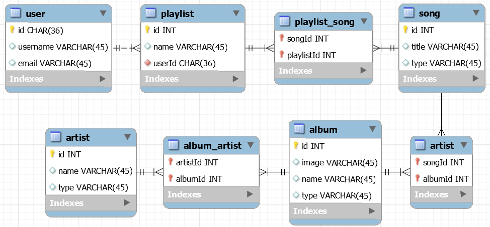

# Spotify Using React/Redux, MySQL and Sequelize

## Aim
For training purposes, let build a **Spotify-like** application. The **EER** (**E**nhanced **E**ntity-**R**elationship model) could be made without much difficulties, but it will be taken from [**Chegg Study**](http://www.chegg.com/homework-help/questions-and-answers/design-mysql-database-support-spotify-like-media-cataloguing-application-application-catal-q19651144). That will be the **ONLY** thing we need to build the whole application.

We get data (from **Spotify** by making requests directly to their **API**) by entering some **keywords** and get every songs containing the entered **keywords**. Following by the selection of songs (along with its **album** and the **artists**. For training purposes, we could use these data as seed for our database (which could be used as an **API**) by sending responses on differents kind of resquests.

## The **EER** (**E**nhanced **E**ntity-**R**elationship model)  

---------------

## Author
* Dinh HUYNH - All Rights Reserved!
* dinh.hu19@yahoo.com